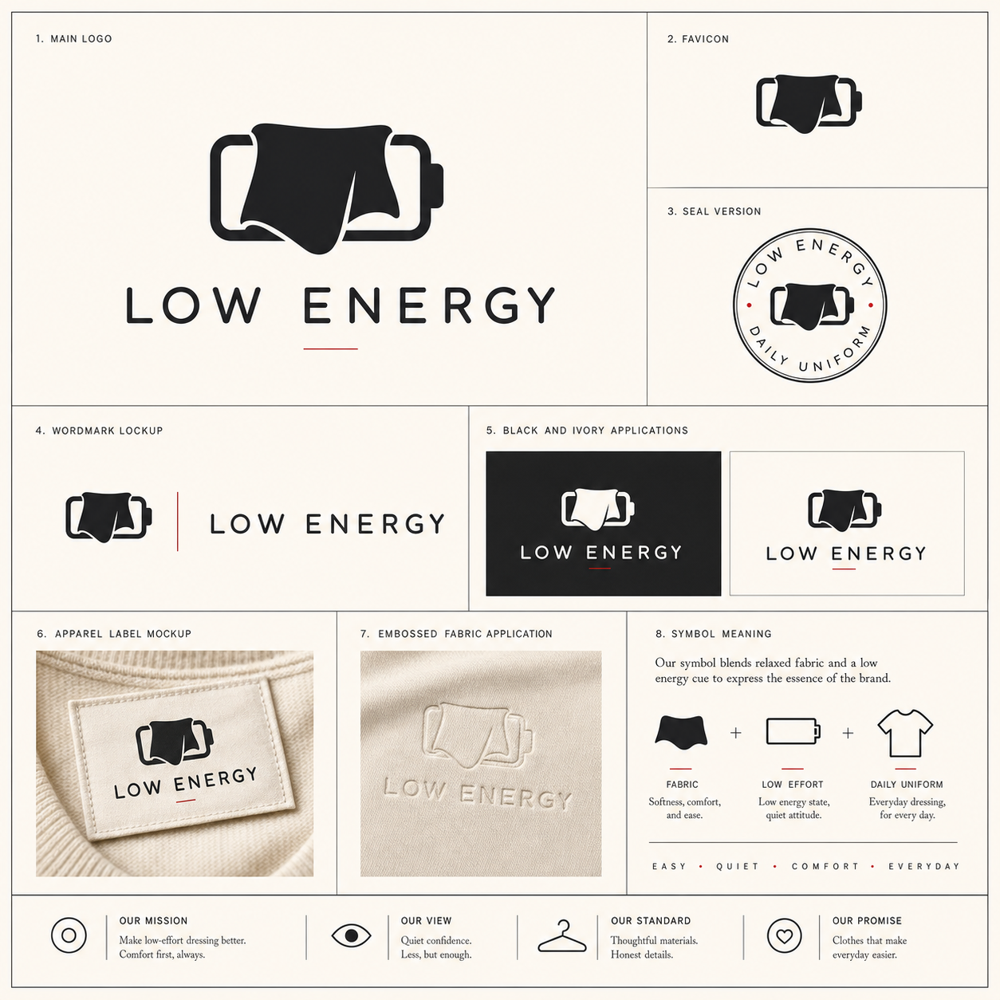

# Brand System Board Generator

[English](README.md)

不只是一张 Logo —— 而是一块完整的**品牌规范展示板**。将一段品牌 brief 转化为精致的编辑级品牌系统规范页，包含主标、favicon、seal、wordmark lockup、应用、mockup、symbol meaning 和底部价值观等编号模块。

## 展示效果

这些样例展示了本 skill 的核心产出：一张高品质品牌系统规范展示板，用来检验一个图形能否发展为真正的品牌识别系统。

### Moss Lab


Moss Lab 被处理为一个安静的科研/创意实验室品牌。方向将苔藓的微观生态感与实验室的精确秩序结合起来：紧凑的培养皿或显微镜载片符号、深森林绿、鲜苔绿色、暖白底，以及清爽现代的无衬线字标。

提示词摘要：生成一张黑白或象牙白品牌系统规范页，文字必须准确读取为 "Moss Lab"；版式包含主标、favicon、seal、lockup、应用、mockup、symbol meaning 和底部价值观。整体需要像编辑型品牌手册，高级、克制、可单色使用，并避开泛泛的 AI 符号。

### LOW ENERGY



LOW ENERGY 被处理为一个低消耗、松弛、日常穿搭品牌。方向将柔软布料褶皱与隐约的低电量负形结合，用炭黑、灰绿色、低饱和天蓝和暖白色建立安静但有辨识度的服装标签气质。

提示词摘要：生成一张黑白或象牙白品牌系统规范页，文字必须准确读取为 "LOW ENERGY"；版式包含主标、favicon、seal、lockup、服装标签应用、mockup、symbol meaning 和底部价值观。整体需要松弛、高级、适合服装品牌，并保持强记忆点。

### SanBaoTech


SanBaoTech 被处理为一家专注 AI、AI 社区和 AI 应用的高级科技公司。新版方向使用英文品牌字标，整体参考这张规范页的设计原则：细边框网格、编号模块、黑白/象牙白配色、少量红色强调、强轮廓符号和编辑型排版。

提示词摘要：生成一张品牌系统规范页，文字必须准确读取为 "SanBaoTech"；版式包含主标、favicon、seal、wordmark lockup、黑白应用、mockup、symbol meaning 和底部价值观。整体以近黑和象牙白为主，需要高级、抽象、可单色使用，并避开机器人头、脑子、电路板等泛 AI 套路。

## 概述

本技能远不止简单的 Logo 图片生成。它产出的是一块**品牌规范展示板** —— 包含完整创意策略、符号构思、视觉系统说明，以及精致的品牌系统规范页版式。它支持公司 Logo、品牌 Logo、文创 Logo、产品 Logo、广告宣传 Logo、活动 Logo、App Logo、子品牌 Logo 等场景。输出针对 **GPT Image**、**Midjourney**、**Flux** 和 **Ideogram** 进行了优化。

默认输出不是一张白底居中的 Logo 图，而是一块**品牌系统规范展示板**：方形象牙白画布、细边框网格、编号模块包含 `MAIN LOGO`、`FAVICON`、`SEAL VERSION`、`WORDMARK LOCKUP`、应用、mockup、symbol meaning 和底部价值观。这种版式专为检验 Logo 能否成为真正的品牌识别系统而设计 —— 测试可缩放性、单色适配、组合灵活性和场景应用 —— 而不仅仅看单张图形是否好看。

## 输入

| 字段 | 必填 | 说明 |
|------|------|------|
| `brand_name` | 是 | 公司、产品、活动、IP 或品牌名称 |
| `brief` | 是 | 被设计对象、目标受众、价值主张、品牌性格与使用场景 |
| `logo_type` | 否 | `company` · `brand` · `product` · `cultural-creative` · `campaign` · `advertising` · `event` · `app` · `sub-brand` · `personal-brand` · `other` |
| `preferred_style` | 否 | 风格偏好，如 `minimal`、`modern`、`heritage modern`、`playful`、`corporate`、`tech`、`luxury`、`bold` |
| `reference_style` | 否 | 用文字描述参考图的版式、留白、字体气质、色彩克制程度和视觉氛围 |
| `output_layout` | 否 | `brand-system-board` · `identity-board` · `standalone-logo` · `square-avatar` · `transparent-asset`；直接出图默认使用 `brand-system-board` |
| `target_platform` | 否 | `gpt-image` · `midjourney` · `flux` · `ideogram` · `all` |
| `render_image` | 否 | 设为 `true` 时，在图像生成能力可用的情况下，先生成最终提示词，再直接生成 Logo 图片 |

## 输出

| 板块 | 说明 |
|------|------|
| **Logo Direction** | 品牌定位、视觉氛围、配色、字体、构图方向 |
| **Symbol Concept** | 核心隐喻、图形形态、与业务的关联说明 |
| **Visual System Notes** | 组合形式、单色适配、小尺寸表现和使用场景说明 |
| **Brand System Board Layout** | 直接出图时的品牌系统规范页：主标、favicon、seal、lockup、应用、mockup、symbol meaning 和底部价值观 |
| **Final Image Prompt** | 可直接粘贴的提示词：通用版、GPT Image、Midjourney、Flux、Ideogram |
| **Generated Logo** | 当 `render_image: true` 或用户要求生成/渲染 Logo 时，返回实际图片结果 |

## 快速开始

```json
{
  "brand_name": "SanBaoTech",
  "logo_type": "company",
  "brief": "一家专注 AI、AI 社区和 AI 应用的科技公司，帮助用户理解、交流并落地 AI 工具与产品。品牌字标使用英文 SanBaoTech。",
  "preferred_style": "minimal, premium, abstract",
  "reference_style": "黑白或象牙白极简品牌系统规范页，带细边框网格、编号模块、主标、favicon、seal、wordmark lockup、黑白应用、mockup、symbol meaning 和底部价值观条。",
  "output_layout": "brand-system-board"
}
```

粘贴上述 JSON（或用自然语言描述公司），然后说：

> 使用 logo-generator skill 生成 Logo 创意方案。

Agent 将返回完整输出板块。将对应平台的提示词复制到图像生成工具即可。

如果想直接出图，可以说：

> 使用 logo-generator skill 直接生成一张 Moss Lab Logo 图片。

或在输入中设置：

```json
{
  "brand_name": "Moss Lab",
  "brief": "一个面向独立开发者和设计师的 AI 工具品牌……",
  "render_image": true
}
```

当请求直接生成图片时，Agent 会先确定创意方向，再使用最合适的 GPT Image 或 Universal 提示词生成一张品牌系统规范展示板：方形画布、细边框网格、编号模块、主标、favicon、seal、wordmark lockup、黑白应用、mockup、symbol meaning 和底部价值观条。如果需要更简单的展示板、单独 Logo、方形头像或透明底，可将 `output_layout` 改为对应格式。

## Brand System Board 风格

直接出图默认采用完整品牌系统规范页：

- 方形象牙白画布，带细外框和内部网格线。
- 编号模块包括 `MAIN LOGO`、`FAVICON`、`SEAL VERSION`、`WORDMARK LOCKUP`、应用、mockup 和 `SYMBOL MEANING`。
- 以黑色和象牙白为主，只在必要处使用极少量深红强调线或圆点。
- 底部增加 `OUR MISSION`、`OUR VIEW`、`OUR STANDARD`、`OUR PROMISE` 等价值观条。
- favicon、seal、lockup、应用和 mockup 都复用同一个核心 symbol，形成完整系统。

这种版式更适合判断 Logo 能不能发展成真正的品牌系统，而不只是看单张居中图是否好看。

## 完整示例：Moss Lab

### 示例输入

```json
{
  "brand_name": "Moss Lab",
  "logo_type": "brand",
  "brief": "一个面向独立开发者和设计师的 AI 工具品牌。Logo 需要聪明、安静、有实验室感，但不要机器人头、脑子、电路板或泛泛的 AI 符号。主要用于网站、App 图标和开源项目头像。",
  "preferred_style": "minimal, quiet, experimental",
  "target_platform": "all",
  "render_image": true
}
```

### 生成结果

#### Logo Direction

将 Moss Lab 定位为一个安静的 AI 工具实验室：精确、实用、克制但有创造力。视觉气质应把"苔藓"的柔和生长感与"实验室标识"的秩序感结合起来，形成一个既有自然触感、又足够工程化的紧凑符号。

配色建议使用深苔绿色、石墨黑、暖白色，并用少量浅薄荷色作为强调。字体建议选择干净的几何无衬线，但带一点人文温度，例如柔和的 grotesk 或圆角技术感字体。构图上需要同时适配网站横向字标、文档中的上下组合，以及 GitHub / App 场景中的方形图标。

这个方向适合 AI 工具品牌，因为它避开了高噪音的未来主义套路，转而传达给开发者和设计师更需要的可靠、好用、审慎和有手艺感。

#### Symbol Concept

核心符号是一个圆角"实验样本砖"：内部用负形构成一个简化的 `M`。这个 `M` 由两段像苔藓生长轨迹的柔和弧形和中间一根精确竖 stem 组成，同时也像被安静观察的一小块实验样本。图形应足够简单，可作为 favicon 使用，同时避免落入常见 AI 视觉俗套。

可选符号路线：

- 极简培养皿圆形，用生长中的负形构成 `M`。
- 将实验烧瓶轮廓压缩成近似叶片的 `M`，但不做成普通植物装饰。
- 把方形终端光标与柔软苔藓斑块结合，表达代码与有机实验。

#### Visual System Notes

建议准备三种组合：图标加横向字标、图标在上字标在下、独立 App / 头像图标。单色版本需要保证负形 `M` 在黑色、白色或苔绿色中都清晰。小尺寸使用时，移除次要细节，只保留圆角样本砖、`M` 负形和一个干净的强调形。

开源项目头像可使用独立符号，背景用暖白色或石墨黑。网站页眉可使用图标加安静字标，并保持充足留白。避免渐变、发光 AI 效果、分子图、过于具象的实验器材和装饰性 swoosh。

#### Final Image Prompt

##### Universal

Create a premium minimalist logo for "Moss Lab", an AI tools brand for independent developers and designers. Design a compact symbol that combines the feeling of soft moss growth with a precise laboratory sample tile. Use a rounded square or circular lab-tile icon with a negative-space `M` formed from two organic arcs and a central stem. Pair it with a clean geometric sans wordmark reading "Moss Lab". Mood: intelligent, calm, experimental, trustworthy. Palette: deep moss green, graphite, warm off-white, pale mint accent. Vector-like, scalable, one-color friendly, favicon-ready. No robot heads, brains, circuit boards, globes, wifi icons, generic AI symbols, light bulbs, shields, or swooshes.

##### GPT Image

Design a clean vector-style logo on a plain warm off-white background for the brand "Moss Lab". The logo should include a compact icon and readable wordmark. The icon is a rounded lab sample tile in deep moss green, with a simple negative-space `M` shaped from two soft moss-like arcs and one precise central stem. The wordmark says exactly "Moss Lab" in a quiet geometric sans typeface with subtle warmth. The overall feeling is intelligent, calm, experimental, and useful for AI tools made for independent developers and designers. Keep the logo flat, premium, balanced, and usable at small app-icon size. Avoid robot heads, brains, circuit boards, generic AI imagery, glowing effects, complex lab equipment, and decorative swooshes.

##### Midjourney

premium minimalist vector logo for "Moss Lab", AI tools brand for indie developers and designers, rounded lab sample tile icon, negative space M made from soft moss arcs and precise central stem, calm intelligent experimental mood, deep moss green graphite warm off-white pale mint accent, clean geometric sans wordmark, flat scalable favicon friendly, no robot head no brain no circuit board no generic AI symbol no glow --ar 1:1 --v 6 --style raw

##### Flux

Moss Lab logo, premium minimalist vector mark, AI tools brand, independent developers and designers, rounded lab sample tile, negative-space M, soft moss arcs, precise central stem, calm intelligent experimental, deep moss green, graphite, warm off-white, pale mint accent, clean geometric sans wordmark, flat design, scalable, one-color friendly, favicon-ready, no robot, no brain, no circuit board, no generic AI icon, no glow

##### Ideogram

Create a clean vector-like logo with exact readable text: "Moss Lab". Use a compact rounded lab-tile icon beside the wordmark. The icon should show a negative-space capital `M` formed by two soft moss-like arcs and a precise central stem. Style: premium minimalist, calm, intelligent, experimental, made for an AI tools brand serving independent developers and designers. Colors: deep moss green, graphite, warm off-white, small pale mint accent. Make the wordmark crisp and correctly spelled. Avoid robot heads, brains, circuit boards, generic AI symbols, glow effects, and clutter.

## 目录结构

```
logo-generator-skill/
├── SKILL.md            # 技能定义与工作流
├── prompt.md           # 输出模板与各平台说明
├── input-schema.json   # 输入 JSON Schema
├── README.md           # 英文文档
└── README.zh-CN.md     # 中文文档（本文件）
```

## 支持的图像模型

| 平台 | 提示词板块 | 说明 |
|------|-----------|------|
| GPT Image | `### GPT Image` | 自然语言描述，布局控制较好 |
| Midjourney | `### Midjourney` | 含 `--ar 1:1 --v 6 --style raw` 参数 |
| Flux | `### Flux` | 简洁关键词风格 |
| Ideogram | `### Ideogram` | 强调文字标识的可读性 |

输入中设置 `"target_platform": "midjourney"` 可聚焦单一平台；默认为 `"all"` 输出全部变体。

## 安装为 Cursor Skill

```bash
# 项目级（团队共享）
cp -r logo-generator-skill .cursor/skills/logo-generator

# 个人级（所有项目可用）
cp -r logo-generator-skill ~/.cursor/skills/logo-generator
```

技能入口文件已命名为 `SKILL.md`。

## 迭代优化

通过 `revision_notes` 在原有方案基础上微调，无需从头开始：

```json
{
  "brand_name": "SanBaoTech",
  "brief": "...",
  "preferred_style": "modern, intelligent, community-minded",
  "revision_notes": "图标更简洁，系统页更像高级品牌手册，字标使用英文 SanBaoTech"
}
```

## 许可证

MIT
