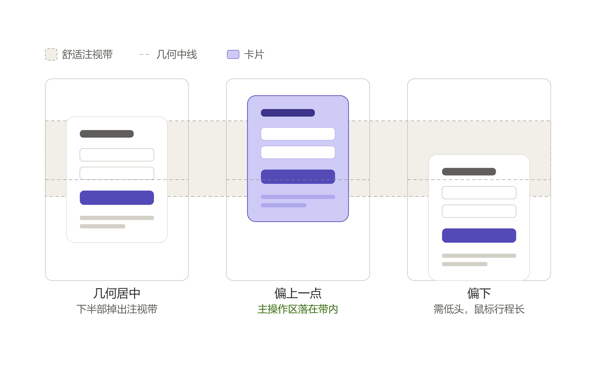

# 垂直定位规范：主内容该放在屏幕的哪个高度

> 适用对象：首屏只有一块主内容（卡片、表单、登录/激活框、弹窗）的页面。
> 核心判断一句话：**不要几何居中，也不要靠下，偏上一点。**

## 1. 结论先行（决策规则）

| 项 | 规则 |
| --- | --- |
| 垂直位置 | **偏上**，不是几何居中（50%），更不是靠下 |
| 量化判据 | 卡片**重心**落在视口高度的 **35%~42%**；更严格地说，「输入框 + 主按钮」这组**主要交互元素**要落在视口 **30%~45%** 区间 |
| 推荐实现 | 顶部锚定 `align-items: flex-start` + 上边距 `clamp(40px, 10vh, 120px)`，**不用** `align-items: center` |
| 水平方向 | 照常居中。左右对称，不存在光学偏移问题 |
| 禁止 | 用纯 `align-items: center` 承载**会变高**的内容（见第 4 节两个坑） |

判断口诀：**上边距小、下边距大，内容只向下生长。**

## 2. 理论依据（用户问"为什么"时引用）

1. **光学中心（Optical Center）**——排版与视觉设计的经典结论：人眼感知到的"中心"比几何中心**高 5%~10%**。因此严格几何居中的物体，看上去是"往下坠"的，需要人为上提才能视觉平衡。
2. **视觉静息位 + F 型扫视**——视线静息位置约在水平线以下 10°~15°；眼动研究（Nielsen Norman Group 的 F 型浏览模式）显示注意力在页面**上部 / 中上部最高**，向下快速衰减。用户进入页面的第一落点天然在中上部。
3. **人因工程视角**——坐姿办公的显示设备视角建议（ISO 9241-5 一类标准）把最佳视线定在水平线以下 15°~30°，对应屏幕**中上部**；再往下就要靠低头 + 颈椎前屈补偿，长时间更累。
4. **底部最差**——底部需要低头，还要与浏览器下载栏 / 系统任务栏抢空间，在矮屏（1366×768）上还最容易被裁切。

反向约束（防止走过头）：**不要贴顶**。按 Fitts 定律，鼠标通常停在中下部，贴顶会显著拉长主按钮的移动行程。所以是"偏上一点"，不是"顶到天上"。

## 3. 对比图



**图注**：三个矩形是浏览器视口，浅色横带是"舒适注视带"，虚线是视口几何中线。

- 左（几何居中）：卡片中点压在几何中线上，但**下半部掉出注视带**——视觉重心偏下。
- 中（偏上一点，推荐）：卡片中点上移到注视带内，**主操作区全部落在带内**。
- 右（偏下）：需低头，鼠标行程长，底部还与系统 UI 冲突。

## 4. 两个必踩的坑（flex 几何居中的代价）

改动布局时，比"上下"更要紧的是这两个真实故障：

1. **内容变高导致整块跳动**：`align-items: center` 下，任何后来展开的内容（成功结果、错误提示、展开区）都会让容器**同时向上和向下**生长，用户刚填完的输入框、正要点的按钮位置全变，页面"跳一下"。
2. **矮屏裁顶且滚不到**：内容高度超过视口时（1366×768 笔记本上极易触发），flex 居中会把**顶部溢出到视口之外，且无法滚动到**——这是经典的 flexbox 居中溢出问题。

## 5. CSS 配方（可直接复制）

```css
body {
  min-height: 100vh;
  display: flex;
  align-items: flex-start;              /* 关键：顶部锚定，不用 center */
  justify-content: center;              /* 水平照常居中 */
  padding: clamp(40px, 10vh, 120px) 20px 40px;  /* 上大下小 → 内容视觉偏上 */
  overflow-y: auto;                     /* 超高时可滚动，不裁顶 */
}
```

为什么是这个值：`10vh` 让卡片顶部停在视口上部，主体落在 30%~45% 的舒适带；`clamp` 的下限 40px 保证矮屏不挤，上限 120px 保证超高屏（27 寸 1440p）不会飘得太高，仍在自然视线 ±15° 内。

**变体**

- 内容简短且确定不会变高（纯静态提示页）：可保留 `align-items: center`，但把 padding 改成不对称 `padding: 6vh 20px 12vh`，把卡片视觉上顶。
- 想保留居中又要防溢出：用 `align-items: safe center`（浏览器支持不完整，仅在确认目标环境支持时使用）。
- 弹窗 / overlay：垂直位置同样取 35%~42%，但需额外保证键盘唤起时不被输入法遮挡（此时可临时上移）。

## 6. 落地案例

`self-service-activation`（卡密激活页，`public/index.html`）原为 `align-items: center` + `padding: 20px`。激活成功后结果区展开约 180~220px，导致整块上跳；在 1366×768 上还会裁顶。已按本规范改为第 5 节的配方，问题解决。

## 7. 检查清单

改动或review 首屏布局时逐条过：

- [ ] 卡片重心在视口 35%~42%，不是 50%
- [ ] 主要交互元素（输入框 + 主按钮）在视口 30%~45%
- [ ] 没有用 `align-items: center` 承载会变高的内容
- [ ] 展开结果 / 错误提示时，已有内容不发生位移
- [ ] 内容超高时可向下滚动，顶部不被裁
- [ ] 在 1366×768 视口下验证过（不只是自己的大屏）
- [ ] 水平方向保持居中

## 8. 反模式

- ❌ "居中看起来最稳妥" → 视觉上偏下，且引入跳动与裁顶
- ❌ "往下放一点，鼠标近好点" → 低头 + 与系统 UI 抢空间 + 矮屏被裁
- ❌ "贴顶部，用户一眼就看到" → 鼠标行程长，超高屏上内容飘出自然视线
- ❌ 只调位置、不验证"结果展开后"的状态 → 布局位移 bug 常藏在这里
